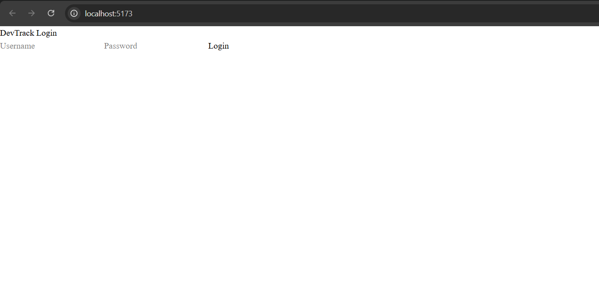
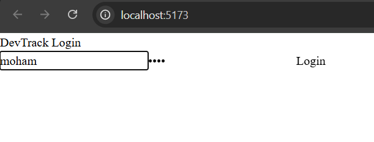
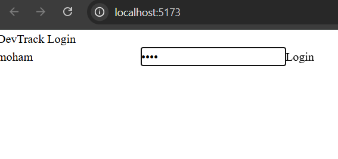
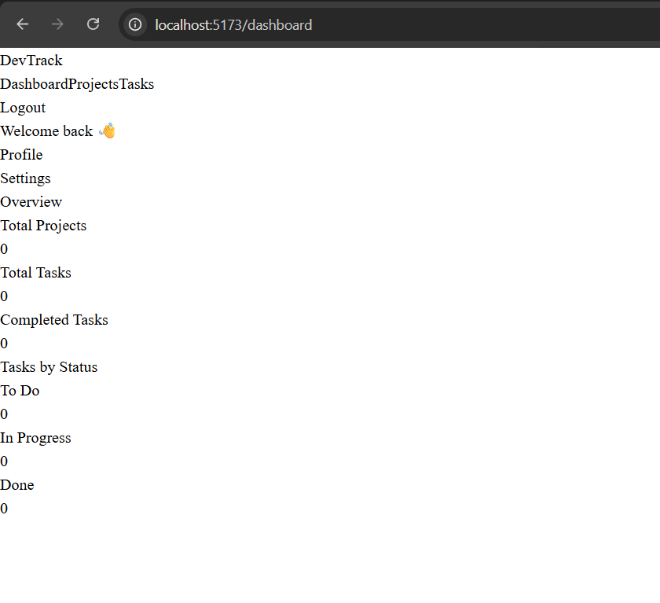
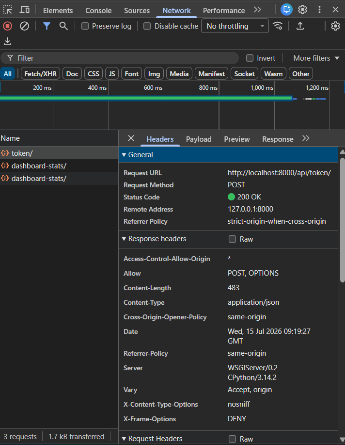
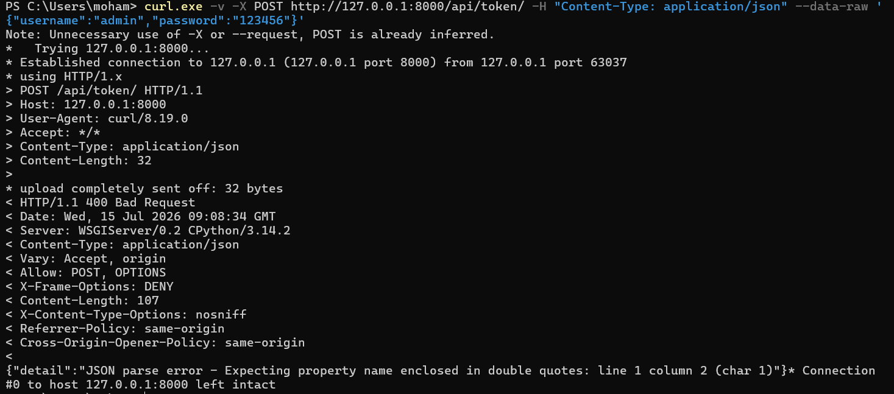
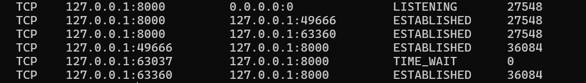
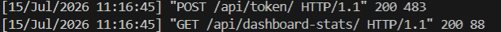

# DevTrack – Full‑Stack Project Management SaaS

DevTrack is a full‑stack project management application built with **Django REST Framework** (backend) and **React + Vite + Tailwind + ShadCN** (frontend).  
It demonstrates real-world engineering skills including authentication, CRUD operations, relational data modeling, dashboards, analytics, and modern UI/UX patterns.

---

## 🚀 Features

### 🔐 Authentication
- JWT login
- Protected routes
- Auto‑logout on expired tokens
- Global Axios interceptors

### 📁 Projects Module
- Create, edit, delete projects
- Empty states, loading states, error states
- Clean ShadCN dialog forms

### 📝 Tasks Module
- Full CRUD
- Tasks linked to projects (relational)
- Status + priority + due date
- Project-based filtering
- Status filtering
- Professional UX with ShadCN components

### 📊 Dashboard Analytics
- Total projects
- Total tasks
- Tasks by status (todo / in progress / done)
- Clean dashboard cards

### 🎨 Modern Frontend Stack
- React + Vite
- Tailwind CSS v4
- ShadCN UI (Radix + Nova)
- React Router v6
- Axios with JWT interceptors

### 🛠 Backend Stack
- Django
- Django REST Framework
- JWT Authentication
- DRF Routers
- Relational models (Projects → Tasks)
- Analytics endpoint

---

## Running the full stack locally

1. Start the backend
```powershell
cd backend
.\env\Scripts\Activate.ps1
python manage.py runserver

cd frontend
npm install
npm run dev


## 📸 Screenshots

### Login

### Login

### Login


### Dashboard


### Projects & Tasks


### Traces




## 🧱 Project Structure

### Frontend (React)

src/
├── api/axios.js
├── components/
├── context/AuthContext.jsx
├── pages/
├── router/
├── main.jsx
└── index.css


### Backend (Django)

devtrack/
├── projects/
├── tasks/
├── accounts/
├── devtrack/
└── manage.py

## 🔧 Installation

### Backend
```bash
cd devtrack-backend
pip install -r requirements.txt
python manage.py migrate
python manage.py runserver

### Frontend

cd devtrack-frontend
npm install
npm run dev

---

## 🔗 API Endpoints

### Auth
POST /api/token/

### Projects

GET    /api/projects/
POST   /api/projects/
PUT    /api/projects/:id/
DELETE /api/projects/:id/


### Tasks
GET    /api/tasks/?project=<id>&status=<status>
POST   /api/tasks/
PUT    /api/tasks/:id/
DELETE /api/tasks/:id/


### Dashboard Analytics
GET /api/dashboard-stats/

## Frontend — Quick start (Vite / React)

**Prerequisites**
- Node 18+ and npm or pnpm
- Backend running at `http://127.0.0.1:8000` (see backend README)

**Install and run**
```bash
cd /path/to/frontend
npm install
npm run dev
# open http://localhost:5173

## 🧑‍💻 Author

**Mohammad Eslamifar**  
Full‑Stack Developer  
Rome, Italy

## ⭐ Why This Project Matters

DevTrack is designed to showcase **real full‑stack engineering skills**:

- Authentication  
- Protected routes  
- Relational database modeling  
- REST API design  
- Modern frontend architecture  
- State management  
- UX patterns  
- Dashboard analytics  
- Error handling  
- Loading states  
- Production‑grade structure  

⭐ If you like this project, consider starring the repo!

